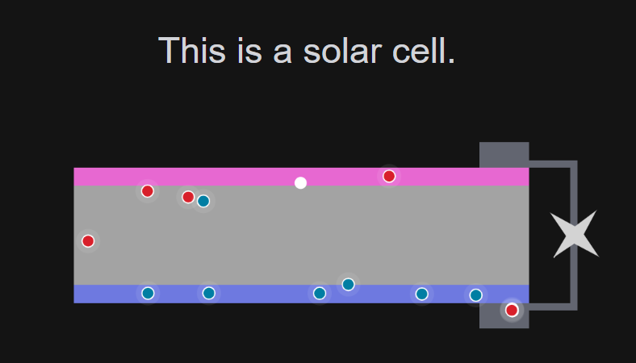

# enerviz.net
## Welcome
This is the repo of my site *[enerviz.net](enerviz.net)*

## Overall description

The website describes the very basics of solar cell operation by using javascript based animations. Each html page references three javascript scripts, the main script is specific to the current html page. The main script uses two supporting scripts called engine and utilities. All the js scripts are written in p5.js. Shoutout to The Coding Train for explaining how to use p5.js in an awesome way.

## Decscription of the supporting scripts
### Engine.js
Engine.js is the core of the program for the animation of solar cells.

#### Classess
It contains five classes:
- Particle: this is the parent class of photons, electrons and holes.
- Photon: this is a child class to the Particle class.
- Electron: this is a child class to the Particle class.
- Hole: this is a child class to the Particle class.
- Load: this is a class to define loads.

#### Methods

Electron, photon and hole have the methods:
- .move() to move around the solar cell
- .collide() for electrons to collide with each others and holes to collide with each other.

Electron, photon, hole and loads have the method:
- .display() to be displayed on the screen

### Utilities.js
Utilities.js contains the functions used during the animation.

#### Functions
It contains four functions:
- initialise() initialise the variables for the simulation so that all simulations on the site have the same starting values.
- electronHoleInteraction() for electrons and holes to collide and recombine.
- displayCellElements() to display various cell elements such as the absorber, the electron selective membrane, the hole selective membrane and the metal contact, wire and load.
- displayLegend() to display the legend of various objects such as photons, electrons, holes and cell elements such as the absorber, the electron selective membrane, the hole selective membrane and the metal contact, wire and load.

## That is it
Let me know if you have any feedback!
